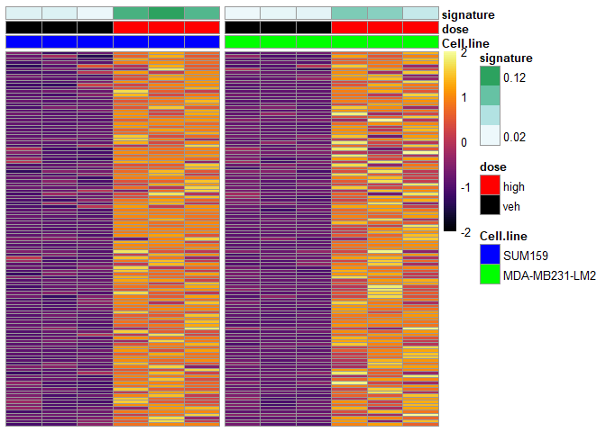
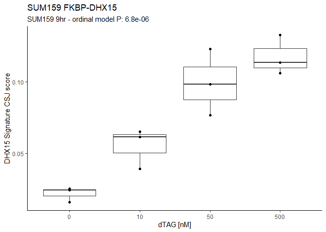
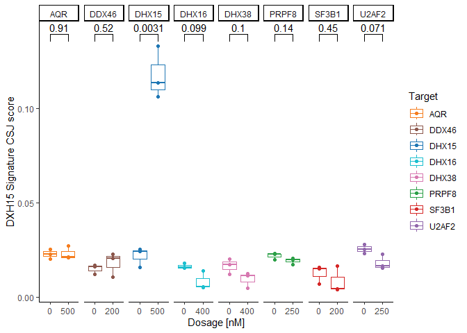
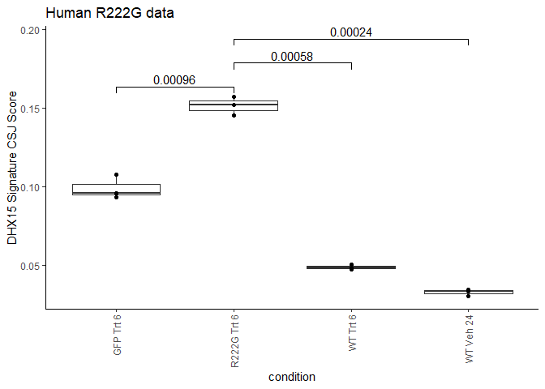

``` r
knitr::opts_chunk$set(echo = TRUE)
```

``` r
# Load R libs ####
library(ggplot2)
library(ggpubr)
library(data.table)
library(pheatmap)
library(readxl)
library(viridis)
```

    ## Loading required package: viridisLite

## Figure 6

### Figure 6A

``` r
# Define functions ####
get_counts <- function(files, junxs) {
  counts <- do.call(cbind, lapply(files, function(file) {
    x <- fread(file, sep = "\t")
    strand <- as.character(x[[4]])
    strand <- gsub("2", "-", strand)
    strand <- gsub("1", "+", strand)
    x$id <- paste(x[[1]], x[[2]], x[[3]], strand, sep = "|")
    x[match(junxs, x$id)][[7]]}))
  counts[is.na(counts)] <- 0
  rownames(counts) <- junxs
  colnames(counts) <- gsub(".SJ.out.tab", "", fixed = TRUE, basename(files))
  return(counts)
}
calculate_score <- function(counts, ujs, kis) {
  uj_counts <- counts[ujs, ]
  ki_counts <- counts[kis, ]
  usage <- uj_counts / (uj_counts + ki_counts)
  dhx15_junc_score <- unlist(lapply(colnames(counts), function(x) {
  matr <- data.frame(
    usage = usage[ujs, x], ki = ki_counts[kis, x], uj = uj_counts[ujs, x])
  mean(matr$usage[matr$ki > 100])}))
  names(dhx15_junc_score) <- colnames(counts)
  return(dhx15_junc_score)
}

# Load data for LM2 & SUM159 heatmap ####
prefix <- "../data/dtag_experiments/"
meta <- fread("../data/dtag_experiments/sum159_lm2_meta.tsv")

name_list <- c("SUM159_D12_dTag13_DHX15_0nM_9hrs-1_classified_junctions.tsv",
               "SUM159_D12_dTag13_DHX15_0nM_9hrs-2_classified_junctions.tsv",
               "SUM159_D12_dTag13_DHX15_0nM_9hrs-3_classified_junctions.tsv",
               "SUM159_D12_dTag13_DHX15_500nM_9hrs-1_classified_junctions.tsv",
               "SUM159_D12_dTag13_DHX15_500nM_9hrs-2_classified_junctions.tsv",
               "SUM159_D12_dTag13_DHX15_500nM_9hrs-3_classified_junctions.tsv",
               "LM2_G10_dTag13_DHX15_0nM_9hrs-1_classified_junctions.tsv",
               "LM2_G10_dTag13_DHX15_0nM_9hrs-2_classified_junctions.tsv",
               "LM2_G10_dTag13_DHX15_0nM_9hrs-3_classified_junctions.tsv",
               "LM2_G10_dTag13_DHX15_50nM_9hrs-1_classified_junctions.tsv",
               "LM2_G10_dTag13_DHX15_50nM_9hrs-2_classified_junctions.tsv",
               "LM2_G10_dTag13_DHX15_50nM_9hrs-3_classified_junctions.tsv")
files <- unlist(lapply(name_list, function(x) paste(prefix, x, sep = "")))
dhx15_specific <- read.delim(
  "../data/dtag_experiments/differential_csj_frequency_table.tsv")
dhx15_specific <- dhx15_specific[-grep("X", dhx15_specific$sum159.uj), ]
ujs <- dhx15_specific$sum159.uj[which(
  dhx15_specific$lm2.coef > 1 & dhx15_specific$sum159.coef > 1)]
kis <- dhx15_specific$sum159.ki[which(
  dhx15_specific$lm2.coef > 1 & dhx15_specific$sum159.coef > 1)]
junxs <- c(ujs, kis)
counts <- get_counts(files, junxs)
uj_counts <- counts[ujs, ]
ki_counts <- counts[kis, ]
usage <- uj_counts / (uj_counts + ki_counts)

# Create signature heatmap ####
anno_col <- data.frame(meta, row.names = colnames(usage))
anno_col$dose <- "veh"
anno_col$dose[anno_col$Dosage.value > 0] <- "high"

anno_col$signature <- calculate_score(counts, ujs, kis)

scale <- function(matr) t(apply(matr, 1, function(x) (x - mean(x)) / sd(x)))

tmp <- cbind(scale(usage[, anno_col$Cell.line == "SUM159"]),
             scale(usage[, anno_col$Cell.line == "MDA-MB231-LM2"]))

p <- pheatmap(tmp,
         cluster_cols = FALSE,
         cluster_rows = FALSE,
         show_rownames = FALSE,
         show_colnames = FALSE,
         gaps_col = 6,
         color = viridis::inferno(100),
         annotation_colors = list(
           dose = c(
             high = "red", veh = "black"), Cell.line = c(
               SUM159 = "blue", `MDA-MB231-LM2` = "green")),
         annotation_col = anno_col[, c("Cell.line", "dose", "signature")],
         breaks = seq(-2, 2, length = 100))
```



### Figure 6C

``` r
score <- fread(paste0("../data/dtag_experiments/",
         "CSJ_signature_score_sum159_dosage_score.tsv"))
meta <- fread(
  "../data/dtag_experiments/CSJ_signature_score_sum159_dosage_meta.tsv")
aframe <- data.frame(meta, score)
afit <- summary(lm(aframe$score ~ as.numeric(as.factor(aframe$Dosage.value))))
pval <- signif(coefficients(afit)[2, 4], 2)

# Figure 6 C
ggplot(aframe,
       aes(factor(Dosage.value), score)) +
  labs(title = "SUM159 FKBP-DHX15",
       subtitle = paste("SUM159 9hr - ordinal model P:", pval),
       y = "DHX15 Signature CSJ score",
       x = "dTAG [nM]") +
  geom_boxplot() + geom_point() +
  theme_classic()
```



### Figure 6D

``` r
# UJ score vs target specificity ####
meta <- fread(
  "../data/dtag_experiments/CSJ_signature_score_splicing_genes_meta.tsv")
score <- fread(
  "../data/dtag_experiments/CSJ_signature_score_splicing_genes_score.tsv")
aframe <- data.frame(score, meta)

farben <- c(U2AF2 = "#9268AC",
            DDX46 = "#8C574C",
            SF3B1 = "#D52828",
            PRPF8 = "#2DA048",
            DHX16 = "#1DBFCF",
            AQR = "#F57E20",
            DHX38 = "#D779B1",
            DHX15 = "#1F77B4")
# Figure 6 D
ggplot(aframe,
       aes(factor(Dosage.value), score, color = Target)) +
  labs(y = "DXH15 Signature CSJ score",
       x = "Dosage [nM]") +
  facet_wrap(~ Target, scales = "free_x", nrow = 1) +
  geom_boxplot() + geom_point() +
  scale_color_manual(values = farben) +
  stat_compare_means(comparisons = list(c(1, 2)),
                     method = "t.test") +
  theme_classic()
```

    ## [1] FALSE



### Figure 6E

``` r
meta <- fread("../data/r222g_mutant/CSJ_signature_score_r222g_mutant_meta.tsv")
score <- fread(
  "../data/r222g_mutant/CSJ_signature_score_r222g_mutant_score.tsv")
aframe <- data.frame(meta, score)

# Figure 6 E
ggplot(aframe,
       aes(condition, score)) +
  labs(title = "Human R222G data",
       y = "DHX15 Signature CSJ Score") +
  geom_boxplot() + geom_point() +
  stat_compare_means(comparisons = list(c(1, 2),
                                        c(2, 3),
                                        c(2, 4)),
                     method = "t.test") +
  theme_classic() +
  theme(axis.text.x = element_text(angle = 90, vjust = 0.5, hjust = 1))
```

    ## [1] FALSE



``` r
score <- fread("../data/depmap/CSJ_signature_score_depmap.tsv")
```

    ## Warning in fread("../data/depmap/CSJ_signature_score_depmap.tsv"): Detected
    ## 1 column names but the data has 2 columns (i.e. invalid file). Added 1 extra
    ## default column name for the first column which is guessed to be row names or an
    ## index. Use setnames() afterwards if this guess is not correct, or fix the file
    ## write command that created the file to create a valid file.

``` r
sample_sra <- fread("../data/depmap/depmap_metadata.tsv")
```

    ## Warning in require_bit64_if_needed(ans): Some columns are type 'integer64'
    ## but package bit64 is not installed. Those columns will print as strange
    ## looking floating point data. There is no need to reload the data. Simply
    ## install.packages('bit64') to obtain the integer64 print method and print the
    ## data again.

``` r
cnv <- fread("../data/depmap/depmap_cnv.tsv")
demeter2 <- fread("../data/depmap/depmap_demeter2.tsv")

aframe <- data.frame(sample_sra, demeter2, cnv)
aframe$cnv_loss <- "no"
aframe$cnv_loss[aframe$cnv < 0.75] <- "yes"

# Quartile low vs high CJ score vs dependency #####
aframe$bins <- cut(aframe$DHX15_score, include.lowest = TRUE,
                   breaks = c(quantile(
                     aframe$DHX15_score, probs = seq(0, 1, length = 5))),
                   labels = c("low", "int1", "int2", "high"))

# Fibroblasts vs rest - ECDF ####
good_tissues <- names(which(table(aframe$lineage) > 10))
lvs <- names(
  sort(unlist(lapply(split(aframe$DHX15_score, aframe$lineage), median))))

aframe$lineage <- factor(aframe$lineage, levels = lvs)
```

### Figure 6F

``` r
# Fibroblasts vs rest - Boxplot ####
ggplot(aframe[aframe$lineage %in% good_tissues, ],
       aes(DHX15_score, lineage, color = (lineage == "fibroblast"))) +
  labs(title = "DepMap",
       subtitle = "Distribution of CJ score across lineages",
       x = "DHX15 Signature CSJ Score",
       y = "Lineage") +
  geom_boxplot(outlier.color = NA) + geom_jitter(height = .1, alpha = 0.5) +
  scale_color_manual(values = c("black", "blue"), name = "Normal") +
  ggpubr::stat_compare_means(
    comparisons = lapply(
      setdiff(
        intersect(
          lvs, good_tissues), "fibroblast"),
      function(x) c("fibroblast", x)), method = "t.test") + theme_classic()
```

    ## [1] FALSE


### Figure 6G

``` r
# Figure 6 G
aframe$Group <- aframe$bins
aframe$Group <- gsub("low", "Bottom 25%", aframe$Group)
aframe$Group <- gsub("high", "Top 25%", aframe$Group)

ggplot(aframe[aframe$Group %in% c("Bottom 25%", "Top 25%"), ],
       aes(Group, demeter2, group = Group, color = Group)) +
  labs(title = "DepMap (pan-cancer)",
       y = "DHX15 Dependency (Demeter2)",
       x = "DHX15 Signature CSJ Score") +
  geom_boxplot(outlier.colour = NA) + geom_jitter(width = 0.1, alpha = 0.5) +
  ggpubr::stat_compare_means(comparisons = list(c("Bottom 25%", "Top 25%"))) +
  scale_color_manual(values = c("black", "red")) +
  theme_classic()
```

    ## [1] FALSE

    ## Warning: Removed 199 rows containing non-finite values (`stat_boxplot()`).

    ## Warning: Removed 199 rows containing non-finite values (`stat_signif()`).

    ## Warning: Removed 199 rows containing missing values (`geom_point()`).

 \### Figure
6H

``` r
# Quartile low vs high CJ score vs dependency - BRCA only #####
subm <- aframe[aframe$lineage == "breast", ]

subm$bins <- cut(subm$DHX15_score, include.lowest = TRUE,
                   breaks = c(
                     quantile(subm$DHX15_score, probs = seq(0, 1, length = 4))),
                   labels = c("Bottom 33%", "int", "Top 33%"))
# Figure 6 H
ggplot(subm[subm$bins %in% c("Top 33%", "Bottom 33%"), ],
       aes(bins, demeter2, group = bins, color = bins)) +
  labs(title = "DepMap",
       subtitle = "breast only",
       y = "DHX15 Demeter2",
       x = "122 DHX15 CJ score") +
  geom_boxplot(outlier.colour = NA) + geom_jitter(width = 0.1, alpha = 0.5) +
  ggpubr::stat_compare_means(comparisons = list(c("Bottom 33%", "Top 33%"))) +
  scale_color_manual(values = c("black", "red")) +
  theme_classic()
```

    ## [1] FALSE


