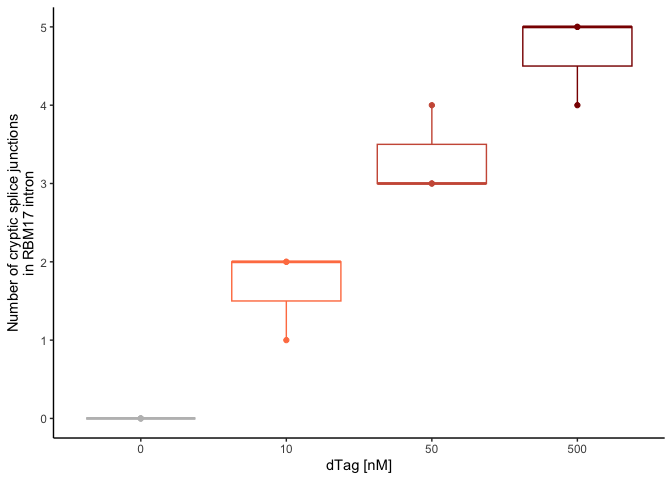
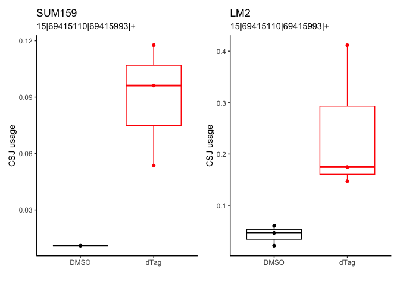

## Figure 2

### Figure 2 D

Increased levels of DHX15 degradation results in dose-dependent cryptic
splice junction accumulation. Box plot quantifies number of cryptic
splice junctions upon DMSO and dTAG13 treatment (median (line), Q1 to Q3
quartile values (boundaries of the box), and range (whiskers), n=3
biological replicates per condition).

``` r
# Load library
library(data.table)
library(GenomicRanges)
```

    ## Loading required package: stats4

    ## Loading required package: BiocGenerics

    ## 
    ## Attaching package: 'BiocGenerics'

    ## The following objects are masked from 'package:stats':
    ## 
    ##     IQR, mad, sd, var, xtabs

    ## The following objects are masked from 'package:base':
    ## 
    ##     anyDuplicated, aperm, append, as.data.frame, basename, cbind,
    ##     colnames, dirname, do.call, duplicated, eval, evalq, Filter, Find,
    ##     get, grep, grepl, intersect, is.unsorted, lapply, Map, mapply,
    ##     match, mget, order, paste, pmax, pmax.int, pmin, pmin.int,
    ##     Position, rank, rbind, Reduce, rownames, sapply, setdiff, sort,
    ##     table, tapply, union, unique, unsplit, which.max, which.min

    ## Loading required package: S4Vectors

    ## 
    ## Attaching package: 'S4Vectors'

    ## The following objects are masked from 'package:data.table':
    ## 
    ##     first, second

    ## The following objects are masked from 'package:base':
    ## 
    ##     expand.grid, I, unname

    ## Loading required package: IRanges

    ## 
    ## Attaching package: 'IRanges'

    ## The following object is masked from 'package:data.table':
    ## 
    ##     shift

    ## Loading required package: GenomeInfoDb

``` r
library(ggplot2)
library(patchwork)

# Load metadata ####
meta <- read.csv("../../data/dtag_experiments/figure_2_meta.csv", row.names = 1)
meta$path <- gsub(" ", "_", meta$Sample.display.name)
meta2 <- meta[meta$Cell.line == "SUM159", ]
files <- meta$path[meta$Cell.line == "SUM159"]
files <- paste0("../../data/dtag_experiments/",
                files, "_classified_junctions.tsv")
dat <- lapply(files, function(x) fread(x, sep = "\t"))

# Count number of CJs in PRDX6 intron ####
# 10:6101382-6104935 RBM17
num_of_cjs <- unlist(lapply(dat, function(x) {
  length(which(x$chrom == 10 & x$start > 6101382 & x$end < 6104935 &
                                         x$class %in% c("matching 3",
                                                      "matching 5",
                                                      "intronic")))
  }))

aframe <- data.frame(meta2, num_of_cjs)
ggplot(aframe,
       aes(factor(Dosage.value), num_of_cjs, color = factor(Dosage.value))) +
  labs(y = "Number of cryptic splice junctions\nin RBM17 intron",
       x = "dTag [nM]") +
  geom_boxplot() +
  geom_point() +
  scale_color_manual(values = c("grey", "coral", "coral3", "darkred")) +
  theme_classic() +
  theme(legend.position = "none")
```

 \### Process
Data

``` r
# Load junction data ####
files <- meta$path[meta$Cell.line == "SUM159" &
                     meta$Dosage.value %in% c(0, 500)]
files <- paste0("../../data/dtag_experiments/",
                files, "_classified_junctions.tsv")
dat <- lapply(files, function(x) fread(x, sep = "\t"))

#cryptic junctions
ujs <- lapply(dat, function(x) {
  x <- x[x$class %in% c("matching 3", "matching 5", "intronic"), ]
  x$id <- paste(x$chrom, x$start, x$end, x$strand, sep = "|")
  x
})

#known introns
kis <- lapply(dat, function(x) {
  x <- x[x$class %in% c("known intron"), ]
  x$id <- paste(x$chrom, x$start, x$end, x$strand, sep = "|")
  x
})

# Find junctions present in all 6 samples ####
junx <- table(unlist(lapply(ujs, function(x) x$id)))
ujs_present_in_four <- names(which(junx >= 4))

junx <- table(unlist(lapply(kis, function(x) x$id)))
kis_present_in_all <- names(which(junx == length(kis)))

# Convert to Grange objects ####
tmp <- do.call(rbind, lapply(ujs_present_in_four,
                             function(x) strsplit(x, "|", fixed = TRUE)[[1]]))
tmp <- data.frame(tmp)
colnames(tmp) <- c("chrom", "start", "end", "strand")
tmp$start <- as.numeric(tmp$start)
tmp$end <- as.numeric(tmp$end)
ujs_grange <- GRanges(seqnames = tmp$chrom,
                      IRanges(start = tmp$start, end = tmp$end),
                      strand = tmp$strand)
ujs_grange@elementMetadata$id <- ujs_present_in_four

first_sample <- kis[[1]]
tmp <- first_sample[match(kis_present_in_all, first_sample$id), ]
kis_grange <- GRanges(seqnames = tmp$chrom,
                      IRanges(start = tmp$start, end = tmp$end),
                      strand = tmp$strand)
kis_grange@elementMetadata$id <- kis_present_in_all

# Find matching know intron for each UJ based on read usage ####
res <- findOverlaps(query = ujs_grange,
                    subject = kis_grange)
merged <- data.frame(uj = ujs_present_in_four[res@from],
                     ki = kis_present_in_all[res@to])

ki_counts <- do.call(cbind,
                     lapply(kis, function(x) x$unique[match(merged$ki, x$id)]))
merged$ki_mean <- rowMeans(ki_counts)

asplit <- split(seq_len(nrow(merged)), merged$uj)
merged2 <- do.call(rbind, lapply(asplit, function(x) {
  if (length(x) == 1) return(data.frame(merged[x, c("uj", "ki")]))
  if (length(x) > 1) {
    subm <- merged[x, ]
    max_in <- which(subm$ki_mean == max(subm$ki_mean))
    return(data.frame(subm[max_in, c("uj", "ki")]))
  }
}))

first_sample <- do.call(rbind, ujs)
merged2$class <- first_sample$class[match(merged2$uj, first_sample$id)]
uj_ki_mapping_sum159 <- merged2

# Extract counts ####
uj_counts <- do.call(cbind,
                     lapply(ujs, function(x) x$unique[match(merged2$uj, x$id)]))
ki_counts <- do.call(cbind,
                     lapply(kis, function(x) x$unique[match(merged2$ki, x$id)]))

uj_counts_sum159 <- uj_counts
ki_counts_sum159 <- ki_counts

# Run regression ####
res <- do.call(rbind, lapply(seq_len(nrow(uj_counts)), function(x) {
  aframe <- data.frame(uj = uj_counts[x, ],
                       ki = ki_counts[x, ],
                       treat = c(rep("control", 3), rep("case", 3)))
  counts <- cbind(aframe$uj,
                  aframe$ki + aframe$uj)
  afit <- try(summary(glm(counts ~ aframe$treat,
                          family = binomial(link = "logit"))))
  if (class(afit) == "try-error") return(c(NA, NA))
  coefficients(afit)[2, c(1, 4)]
}))
final_sum159 <- data.frame(coef = -res[, 1], pval = res[, 2],
                    merged2)

### Repeat for LM2 samples ####
files <- meta$path[meta$Cell.line == "MDA-MB231-LM2"]
files <- paste0("../../data/dtag_experiments/",
                files, "_classified_junctions.tsv")
dat <- lapply(files, function(x) fread(x, sep = "\t"))

#cryptic junctions
ujs <- lapply(dat, function(x) {
  x <- x[x$class %in% c("matching 3", "matching 5", "intronic"), ]
  x$id <- paste(x$chrom, x$start, x$end, x$strand, sep = "|")
  x
})

#known introns
kis <- lapply(dat, function(x) {
  x <- x[x$class %in% c("known intron"), ]
  x$id <- paste(x$chrom, x$start, x$end, x$strand, sep = "|")
  x
})

# Find junctions present in all 6 samples ####
junx <- table(unlist(lapply(ujs, function(x) x$id)))
ujs_present_in_four <- names(which(junx >= 4))

junx <- table(unlist(lapply(kis, function(x) x$id)))
kis_present_in_all <- names(which(junx == length(kis)))

# Convert to Grange objects ####
tmp <- do.call(rbind,
               lapply(ujs_present_in_four,
                      function(x) strsplit(x, "|", fixed = TRUE)[[1]]))
tmp <- data.frame(tmp)
colnames(tmp) <- c("chrom", "start", "end", "strand")
tmp$start <- as.numeric(tmp$start)
tmp$end <- as.numeric(tmp$end)
ujs_grange <- GRanges(seqnames = tmp$chrom,
                      IRanges(start = tmp$start, end = tmp$end),
                      strand = tmp$strand)
ujs_grange@elementMetadata$id <- ujs_present_in_four

first_sample <- kis[[1]]
tmp <- first_sample[match(kis_present_in_all, first_sample$id), ]
kis_grange <- GRanges(seqnames = tmp$chrom,
                      IRanges(start = tmp$start, end = tmp$end),
                      strand = tmp$strand)
kis_grange@elementMetadata$id <- kis_present_in_all

# Find matching know intron for each UJ based on read usage ####
res <- findOverlaps(query = ujs_grange,
                    subject = kis_grange)
merged <- data.frame(uj = ujs_present_in_four[res@from],
                     ki = kis_present_in_all[res@to])

ki_counts <- do.call(cbind,
                     lapply(kis, function(x) x$unique[match(merged$ki, x$id)]))
merged$ki_mean <- rowMeans(ki_counts)

asplit <- split(seq_len(nrow(merged)), merged$uj)
merged2 <- do.call(rbind, lapply(asplit, function(x) {
  if (length(x) == 1) return(data.frame(merged[x, c("uj", "ki")]))
  if (length(x) > 1) {
    subm <- merged[x, ]
    max_in <- which(subm$ki_mean == max(subm$ki_mean))
    return(data.frame(subm[max_in, c("uj", "ki")]))
  }
}))

first_sample <- do.call(rbind, ujs)
merged2$class <- first_sample$class[match(merged2$uj, first_sample$id)]
uj_ki_mapping_lm2 <- merged2

# Extract counts ####
uj_counts <- do.call(cbind,
                     lapply(ujs, function(x) x$unique[match(merged2$uj, x$id)]))
ki_counts <- do.call(cbind,
                     lapply(kis, function(x) x$unique[match(merged2$ki, x$id)]))

uj_counts_lm2 <- uj_counts
ki_counts_lm2 <- ki_counts

# Run regression ####
res <- do.call(rbind, lapply(seq_len(nrow(uj_counts)), function(x) {
  aframe <- data.frame(uj = uj_counts[x, ],
                       ki = ki_counts[x, ],
                       treat = c(rep("control", 3), rep("case", 3)))
  counts <- cbind(aframe$uj,
                  aframe$ki + aframe$uj)
  afit <- try(summary(glm(counts ~ aframe$treat,
                          family = binomial(link = "logit"))))
  if (class(afit) == "try-error") return(c(NA, NA))
  coefficients(afit)[2, c(1, 4)]
}))
final <- data.frame(coef = -res[, 1], pval = res[, 2],
                    merged2)
final_lm2 <- final
```

### Figure 7 J

Usage of cryptic splice sites is similarly increased in both SUM159 and
LM2 cells with DHX15 degradation. Frequency of cryptic splicing was
quantified using a generalized binomial model comparing the splicing
frequency of cryptic versus canonical junctions. Scatter plot of
differential frequency of cryptic splicing -/+ DHX15 degradation in both
SUM159 and LM2 cells. Differential cryptic splicing frequency is
significantly correlated between the two cell lines.

``` r
# Compare LM2 to SUM159 ####
ok <- intersect(rownames(final_sum159), rownames(final_lm2))
uj_ki_mapping_both <- data.frame(sum159 = uj_ki_mapping_sum159[ok, ],
                                 lm2  = uj_ki_mapping_lm2[ok, ])

uj_ki_mapping_both$gene_id <- first_sample$gene_ids[
  match(uj_ki_mapping_both$sum159.uj, first_sample$id)]

aframe <- data.frame(sum159 = final_sum159[ok, ],
                     lm2 = final_lm2[ok, ],
                     uj_ki_mapping_both)

signature_table <- aframe[aframe$lm2.coef > 1 & aframe$sum159.coef > 1, ]
signature_table <- signature_table[-grep("X", signature_table$sum159.uj), ]
correl <- cor.test(aframe$sum159.coef, aframe$lm2.coef)
ggplot(aframe, aes(sum159.coef, lm2.coef)) +
  labs(title = "Differential frequency of cryptic splicing", 
       subtitle = paste("Correlation coefficient",
                        "Rho", signif(correl$estimate, 2),
                        "P", signif(correl$p.value, 2)), 
       x = "SUM159\n(dTAG vs DMSO)", y = "LM2\n(dTAG vs DMSO)") +
  geom_vline(xintercept = 0, linetype = "dashed") +
  geom_hline(yintercept = 0, linetype = "dashed") +
  geom_point(alpha = 0.5, color = "black") +
  geom_smooth(method = lm, color = "red") +
  coord_fixed(ratio = 1) +
  theme_classic()
```

    ## `geom_smooth()` using formula = 'y ~ x'


### Figure 2 K

Cryptic splice junction usage is increased in both SUM159 and LM2 cells
upon DHX15 degradation. Box plot depicts fold change in cryptic junction
usage between DMSO and dTAG13 treated states induces increased cryptic
junction usage in both SUM159 and LM2 cells (median (line), Q1 to Q3
quartile values (boundaries of the box), and range (whiskers), n=3
biological replicates per condition).

``` r
# Create plots ####
create_plot <- function(junx, uj_counts, ki_counts, title) {
  x <- which(merged2$uj == junx)
  aframe <- data.frame(uj = uj_counts[x, ],
                       ki = ki_counts[x, ],
                       treat = c(rep("ctrl", 3), rep("treated", 3)))
   ggplot(aframe, aes(treat, uj / ki, color = treat)) +
    labs(title = title,
         subtitle = merged2$uj[x],
         y = "CSJ usage",
         x = "") +
    geom_boxplot() + geom_point() +
    scale_x_discrete(labels = c("DMSO", "dTag")) +
    scale_color_manual(values = c("black", "red")) +
    theme_classic() +
    theme(legend.position = "none")
}

sum159_plot <- create_plot("15|69415110|69415993|+",
                 uj_counts = uj_counts_sum159,
                 ki_counts = ki_counts_sum159,
                 "SUM159")

lm2_plot <- create_plot("15|69415110|69415993|+",
                 uj_counts = uj_counts_lm2,
                 ki_counts = ki_counts_lm2,
                 "LM2")

sum159_plot + lm2_plot
```


