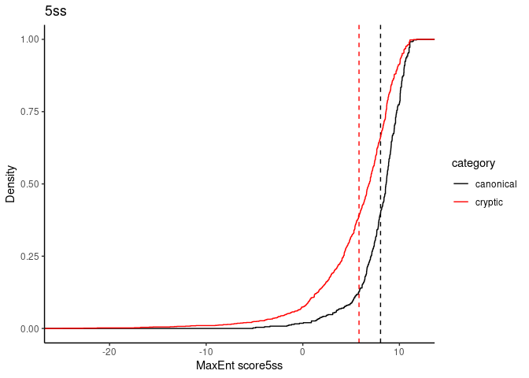
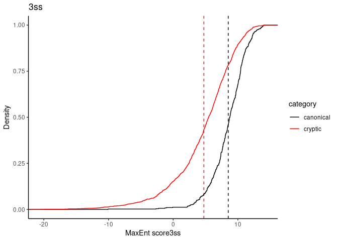
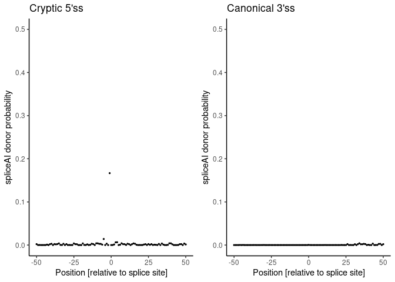
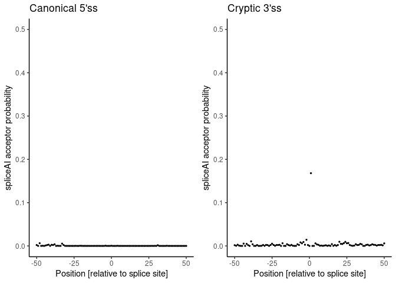
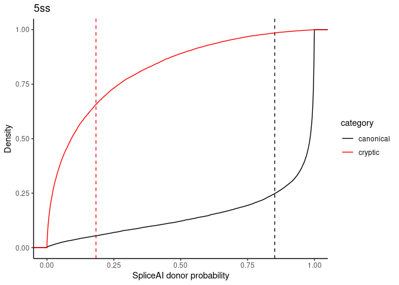
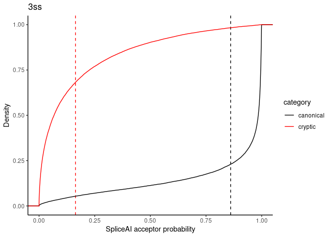

## Figure 3

``` r
# Load R libs ####
library(ggplot2)
library(data.table)
library(gridExtra)
```

(E, F) Cryptic splice sites used upon DHX15 degradation are weaker than
canonical splice sites. Empirical cumulative distribution curves of
MaxENT predicted splice site strength of both cryptic and canonical (E)
5’ss and (F) 3’ss are plotted. A leftward shift in the black curve
indicates decreased splice site strength of cryptic splice junctions.

``` r
# Load SpliceAI predictions donor ####
preds <- read.csv(
  "../../data/figure3/spliceai_donor_greater_3.csv", row.names = 1)
info <- read.delim("../../data/figure3/match_3_plus.tsv")
info$id <- paste(info$chrom, info$start, info$end, info$strand, sep = "|")
ok <- match(unique(info$id), info$id)
preds <- data.frame(info[ok, ], preds[ok, ])

tmp_donor_spliceai <- reshape2::melt(
  preds, measure.vars = c("UJ_match_3", "KI_donor"))
tmp_donor_spliceai$variable <- gsub("UJ_match_3", "cryptic", fixed = TRUE,
                                    tmp_donor_spliceai$variable)
tmp_donor_spliceai$variable <- gsub("KI_donor", "canonical", fixed = TRUE,
                                    tmp_donor_spliceai$variable)

preds <- read.csv(
  "../../data/figure3/spliceai_acceptor_greater_3.csv", row.names = 1)
info <- read.delim("../../data/figure3/match_5_plus.tsv")
info$id <- paste(info$chrom, info$start, info$end, info$strand, sep = "|")
ok <- match(unique(info$id), info$id)
preds <- data.frame(info[ok, ], preds[ok, ])

tmp_acceptor_spliceai <- reshape2::melt(
  preds, measure.vars = c("UJ_match_5", "KI_acceptor"))
tmp_acceptor_spliceai$variable <- gsub("UJ_match_5", "cryptic", fixed = TRUE,
                                       tmp_acceptor_spliceai$variable)
tmp_acceptor_spliceai$variable <- gsub("KI_acceptor", "canonical", fixed = TRUE,
                                       tmp_acceptor_spliceai$variable)

# Load Brian MaxEnt data ####
ki_3ss <- read.delim("../../data/figure3/3ss_canon_seqs.tsv",
                     row.names = 1)[, 1]

uj_3ss <- read.delim("../../data/figure3/3ss_trt_seqs.tsv",
                     row.names = 1)
uj_3ss <- unlist(uj_3ss[, grep("rand", colnames(uj_3ss))])

ki_5ss <- read.delim("../../data/figure3/5ss_canon_seqs.tsv",
                     row.names = 1)[, 1]

uj_5ss <- read.delim("../../data/figure3/5ss_trt_seqs.tsv",
                     row.names = 1)
uj_5ss <- unlist(uj_5ss[, grep("rand", colnames(uj_5ss))])

tmp_3ss <- rbind(data.frame(type = "canonical", score = ki_3ss),
                   data.frame(type = "cryptic", score = uj_3ss))

tmp_5ss <- rbind(data.frame(type = "canonical", score = ki_5ss),
                      data.frame(type = "cryptic", score = uj_5ss))
```

### Figure 3 E

``` r
ggplot(tmp_5ss, aes(score, color = type)) +
  labs(title = "5ss",
       x = "MaxEnt score5ss",
       y = "Density") +
  geom_vline(xintercept = mean(tmp_5ss$score[tmp_5ss$type == "cryptic"]),
             linetype = "dashed", color = "red") +
  geom_vline(xintercept = mean(tmp_5ss$score[tmp_5ss$type == "canonical"]),
             linetype = "dashed", color = "black") +
  stat_ecdf() +
  scale_color_manual(values = c("black", "red"), name = "category") +
  theme_classic()
```

 \#\#\# Figure 3 F

``` r
ggplot(tmp_3ss, aes(score, color = type)) +
  labs(title = "3ss",
       x = "MaxEnt score3ss",
       y = "Density") +
  geom_vline(xintercept = mean(tmp_3ss$score[tmp_3ss$type == "cryptic"]),
             linetype = "dashed", color = "red") +
  geom_vline(xintercept = mean(tmp_3ss$score[tmp_3ss$type == "canonical"]),
             linetype = "dashed", color = "black") +
  stat_ecdf() +
  scale_color_manual(values = c("black", "red"), name = "category") +
  theme_classic()
```

 \#\#\# Figure 3 H

1.  Cryptic splice sites used upon DHX15 degradation have higher splice
    prediction scores compared to surrounding nucleotides. SpliceAI
    analysis was used to predict the splice site probability of each
    nucleotide in a 200bp window centered on a cryptic splice site.
    Shown is the mean SpliceAI probability score for 100 randomly
    selected cryptic splice sites. Splice donor and acceptor probability
    were calculated for canonical 3’ss and canonical 5’ss, respectively,
    as a negative control

### Figure 3 H Cryptic 5’ss

``` r
match5_acc_left_500 <- fread("../../data/figure3/match_5_acc_left_500")
match5_acc_right_500 <- fread("../../data/figure3/match_5_acc_righ_500")

match3_do_left_500 <- fread("../../data/figure3/match_3_do_left_500")
match3_do_right_500 <- fread("../../data/figure3/match_3_do_righ_500")

read_file_average <- function(match3_acc) {
  m3_acc <- match3_acc[2:501, 1:10000]
  colnames(m3_acc) <- as.character(c(1:10000))
  m3_acc <- m3_acc[1:500, 4950:5050]
  mean_pred <- unlist(lapply(m3_acc, mean), use.names = FALSE)
  df <- data.frame(position = c(- 50:50), predict = mean_pred)
  df
}
```

``` r
p3 <- ggplot(
  read_file_average(match3_do_left_500), aes(x = position, y = predict)) +
  geom_point(size = 0.5) +
  ggtitle("Cryptic 5'ss") +
  xlab("Position [relative to splice site]") +
  ylab("spliceAI donor probability") +
  ylim(0, 0.5) +
  theme_classic()

p4 <- ggplot(
  read_file_average(match3_do_right_500), aes(x = position, y = predict)) +
  geom_point(size = 0.5) +
  ggtitle("Canonical 3'ss") +
  xlab("Position [relative to splice site]") +
  ylab("spliceAI donor probability") +
  ylim(0, 0.5) +
  theme_classic()


grid.arrange(p3, p4, ncol = 2, nrow = 1)
```

 \#\#\#
Figure 3 H Cryptic 3’ss

``` r
p1 <- ggplot(
  read_file_average(match5_acc_left_500), aes(x = position, y = predict)) +
  geom_point(size = 0.5) +
  ggtitle("Canonical 5'ss") +
  xlab("Position [relative to splice site]") +
  ylab("spliceAI acceptor probability") +
  ylim(0, 0.5) +
  theme_classic()

p2 <- ggplot(
  read_file_average(match5_acc_right_500), aes(x = position, y = predict)) +
  geom_point(size = 0.5) +
  ggtitle("Cryptic 3'ss") +
  xlab("Position [relative to splice site]") +
  ylab("spliceAI acceptor probability") +
  ylim(0, 0.5) +
  theme_classic()


grid.arrange(p1, p2, ncol = 2, nrow = 1)
```

 \#\#\#
Figure 3 I

(I – J) Cryptic splice sites used upon DHX15 degradation are weaker than
canonical splice sites. Empirical cumulative distribution curves of
SpliceAI predicted splice site strength of both cryptic and canonical
(I) 5’ss and (J) 3’ss are plotted. A leftward shift in the black curve
indicates decreased splice site strength of cryptic splice junctions.

``` r
# Combine into one plot ####
ggplot(tmp_donor_spliceai, aes(value, color = variable)) +
  labs(title = "5ss",
       x = "SpliceAI donor probability",
       y = "Density") +
  geom_vline(
    xintercept = mean(
      tmp_donor_spliceai$value[tmp_donor_spliceai$variable == "cryptic"]),
             linetype = "dashed", color = "red") +
  geom_vline(
    xintercept = mean(
      tmp_donor_spliceai$value[tmp_donor_spliceai$variable == "canonical"]),
             linetype = "dashed", color = "black") +
  stat_ecdf() +
  scale_color_manual(values = c("black", "red"), name = "category") +
  theme_classic()
```

 \#\#\# Figure 3 J

``` r
ggplot(tmp_acceptor_spliceai, aes(value, color = variable)) +
  labs(title = "3ss",
       x = "SpliceAI acceptor probability",
       y = "Density") +
  geom_vline(
    xintercept = mean(
      tmp_acceptor_spliceai$value[tmp_acceptor_spliceai$variable == "cryptic"]),
             linetype = "dashed", color = "red") +
  geom_vline(xintercept = mean(
    tmp_acceptor_spliceai$value[tmp_acceptor_spliceai$variable == "canonical"]),
             linetype = "dashed", color = "black") +
  stat_ecdf() +
  scale_color_manual(values = c("black", "red"), name = "category") +
  theme_classic()
```


