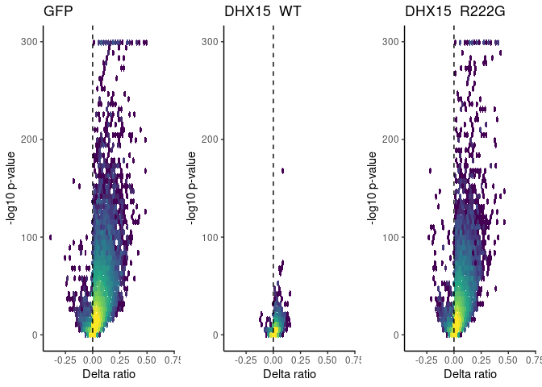
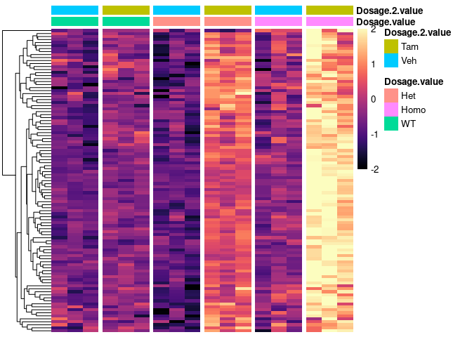

## Figure 5

### Figure 5 D

DHX15R222G does not rescue RNA misprocessing induced by DHX15
degradation. RNA misprocessing analysis was performed on RNA from
LM2-FKBP cell lines expressing GFP, DHX15WT or DHX15R222G and treated
with DMSO or dTAG13. RNA misprocessing ratio is calculated on a single
intron basis as the difference in proportion of mis-spliced fragments
versus properly spliced fragments. Volcano plot represents the
misprocessing ratio between DMSO and dTAG-treated samples. Color
indicates number of introns.

``` r
library(ggplot2)
library(pheatmap)
library(gridExtra)
library(viridisLite)
```

``` r
filelist <- c(
  "../../data/r222g_mutant/diff_misproc_tabs/DHX15_LM2__WT_vs_WT_Trt_vs_Veh__6hr.csv",
  "../../data/r222g_mutant/diff_misproc_tabs/DHX15_LM2__GFP_vs_WT_Trt_vs_Veh__6hr.csv",
  "../../data/r222g_mutant/diff_misproc_tabs/DHX15_LM2__R222G_vs_WT_Trt_vs_Veh__6hr.csv"
)

exp_introns <- read.delim(
  "../../data/r222g_mutant/exp_introns.tsv",
  header = FALSE
)

filnam <- strsplit(filelist[1], "/")[[1]]
filnam <- filnam[length(filnam)]
filnam <- strsplit(filnam, split = "__", fixed = TRUE)[[1]][2]
filnam <- strsplit(filnam, split = "_Trt", fixed = TRUE)[[1]][1]
test <- read.delim(filelist[1], row.names = 1)
test_filt <- test[exp_introns$V1, c("binomial_test_adj_p", "delta_ratio")]
test_filt[test_filt$binomial_test_adj_p <= 1e-300,
          "binomial_test_adj_p"] <- 1e-300
p1 <- ggplot(test_filt,
                     aes(delta_ratio, -log10(binomial_test_adj_p))) +
  geom_hex(bins = 50) +
  xlim(-0.4, 0.7) +
  ylim(-1.5, 301.5) +
  scale_fill_viridis_c(trans = "log", breaks = c(1, 10, 100, 1000),
                       limits = c(1, 1000), na.value = "#FDE725FF") +
  xlab("Delta ratio") +
  ylab("-log10 p-value") +
  labs(title = "DHX15  WT") +
  geom_vline(xintercept = 0, linetype = "dashed") +
  theme_classic() +
  theme(legend.position = "none")

filnam <- strsplit(filelist[2], "/")[[1]]
filnam <- filnam[length(filnam)]
filnam <- strsplit(filnam, split = "__", fixed = TRUE)[[1]][2]
filnam <- strsplit(filnam, split = "_Trt", fixed = TRUE)[[1]][1]
test <- read.delim(filelist[2], row.names = 1)
test_filt <- test[exp_introns$V1, c("binomial_test_adj_p", "delta_ratio")]
test_filt[test_filt$binomial_test_adj_p <= 1e-300,
          "binomial_test_adj_p"] <- 1e-300
p2 <- ggplot(test_filt,
                     aes(delta_ratio, -log10(binomial_test_adj_p))) +
  geom_hex(bins = 50) +
  xlim(-0.4, 0.7) +
  ylim(-1.5, 301.5) +
  scale_fill_viridis_c(trans = "log", breaks = c(1, 10, 100, 1000),
                       limits = c(1, 1000), na.value = "#FDE725FF") +
  xlab("Delta ratio") +
  ylab("-log10 p-value") +
  labs(title = "GFP") +
  geom_vline(xintercept = 0, linetype = "dashed") +
  theme_classic() +
  theme(legend.position = "none")

filnam <- strsplit(filelist[3], "/")[[1]]
filnam <- filnam[length(filnam)]
filnam <- strsplit(filnam, split = "__", fixed = TRUE)[[1]][2]
filnam <- strsplit(filnam, split = "_Trt", fixed = TRUE)[[1]][1]
test <- read.delim(filelist[3], row.names = 1)
test_filt <- test[exp_introns$V1, c("binomial_test_adj_p", "delta_ratio")]
test_filt[test_filt$binomial_test_adj_p <= 1e-300,
          "binomial_test_adj_p"] <- 1e-300
p3 <- ggplot(test_filt,
                     aes(delta_ratio, -log10(binomial_test_adj_p))) +
  geom_hex(bins = 50) +
  xlim(-0.4, 0.7) +
  ylim(-1.5, 301.5) +
  scale_fill_viridis_c(trans = "log", breaks = c(1, 10, 100, 1000),
                       limits = c(1, 1000), na.value = "#FDE725FF") +
  xlab("Delta ratio") +
  ylab("-log10 p-value") +
  geom_vline(xintercept = 0, linetype = "dashed") +
  labs(title = "DHX15  R222G") +
  theme_classic() +
  theme(legend.position = "none")

final <- grid.arrange(p2, p1, p3, ncol = 3, nrow = 1)
```



### Figure 5 I

Introduction of heterozygous and homozygous DHX15R222G mutation in
AML1-ETO 9a cell lines induces misprocessing of similar introns.
Principle component analysis was used to identify the most important
features that distinguish heterozygous DHX15R222G mutation from DHX15WT.
Heat map depicts misprocessing ratio of introns significantly increased
with heterozygous DHX15 mutation.

``` r
misproc_tab <- read.table(
  "../../data/aml_mouse/pc2_select_introns_heatmap.tsv", sep = "\t",
  header = TRUE, row.names = 1)

meta <- read.table("../../data/aml_mouse/pc2_select_introns_meta.tsv",
                   sep = "\t", header = TRUE, row.names = 1)

pheatmap(misproc_tab,
      breaks = seq(-2, 2, length = 100),
      gaps_col = c(3, 6, 9, 12, 15),
      cluster_rows = TRUE,
      col = magma(100),
      cluster_cols = FALSE,
      annotation_col = meta[, c("Dosage.value", "Dosage.2.value")],
      show_rownames = FALSE, show_colnames = FALSE,
      border_color = NA
      )
```


