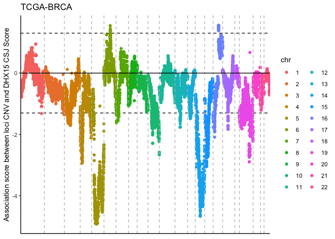
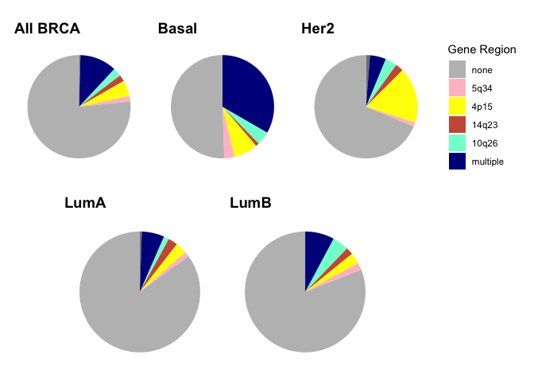
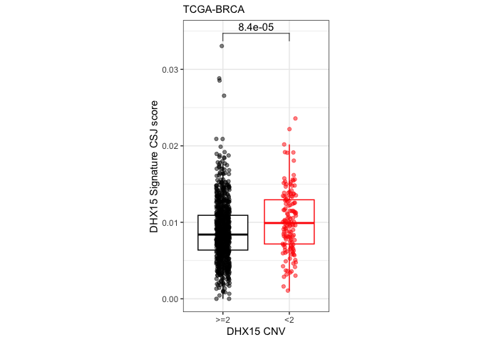
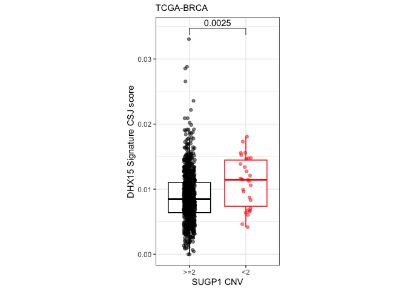

## Figure 7

### Figure 7 A

Genome-wide association identifies multiple alleles associated with
DHX15 signature CSJ score in BRCA TCGA cohort. Manhattan plot depicts
association of gene CNV change with DHX15 CSJ score. Genes with negative
association suggests that loss of a given gene correlates with increased
CSJ score. Chromosomal loci with association \<2 were investigated
further.

``` r
#Load GWAS results ####
tcga <- read.delim("../../data/tcga_brca/tcga_brca_cnv_csj_genome_wide_association.tsv")

# Correct for multiple testing ####
tcga$p_adj <- p.adjust(tcga$pvalue, method = "BH")

# Calculate score after multiple testing correction ####
tcga$score_adj <- -log10(tcga$p_adj)
tcga$score_adj[tcga$difference < 0] <-
  (tcga$score_adj[tcga$difference < 0]) * (-1)

# Create TCGA BRCA Manhatten plot ####
tcga <- tcga[tcga$chr %in% as.character(1:22), ]
tcga$chr <- factor(tcga$chr, levels = as.character(1:22))

aframe <- tcga
aframe$gene <- factor(aframe$gene,
                      levels = aframe$gene[order(aframe$chr, aframe$pos)])
aframe <- aframe[order(aframe$gene), ]

ggplot(aframe,
       aes(gene, (-1) * score_adj, color = chr)) +
  labs(title = "TCGA-BRCA",
       y = "Association score between loci CNV and DHX15 CSJ Score") +
  geom_hline(yintercept = c(-log10(0.05), log10(0.05)),
             linetype = "dashed") +
  geom_point() +
  geom_vline(xintercept = match(unique(aframe$chr), aframe$chr),
             linetype = "dashed", color = "grey") +
  geom_hline(yintercept = 0) +
  theme_classic() +
  theme(axis.title.x = element_blank(),
        axis.text.x = element_blank(),
        axis.ticks.x = element_blank()
        )
```



### Figure 7 B

Loss of chromosomal bands associated with increased DHX15 signature CSJ
score occurs in \~22% of BRCA patients, with Basal tumors experiencing
the greatest percentage of loss. Chromosomal bands (5q34, 4p15, 19q13,
14q23, and 10q26) with association \<2 were investigated for their
frequency of loss across TCGA tumors. Pie chart depicts the percent of
tumors with deletion of none, one, or multiple of these genes across all
tumors or by individual subtype.

``` r
#Load TCGA CNV data
load("../../data/tcga_brca/tcga_brca_cnv.RData")

# Load recount data junction score ####
usage <- read.csv("../../data/tcga_brca/tcga_brca_csj_usage.csv",
                  row.names = 1)
ki_counts <- read.csv("../../data/tcga_brca/tcga_brca_known_intron_counts.csv",
                      row.names = 1)
metadata <- read.csv("../../data/tcga_brca/tcga_brca_metadata.csv")

samples <- unlist(lapply(metadata$tcga_barcode, function(x) {
  paste(strsplit(x, "-", fixed = TRUE)[[1]][1:4], collapse = "-")
  }))
metadata$id <- samples

colnames(usage) <- colnames(ki_counts) <- samples
usage[is.na(usage)] <- 0

ok <- intersect(colnames(cnv_assay), colnames(usage))

genes <- c("DHX15", "WWC1", "INPP5A", "DHX34", "ESR2")

dels <- apply(cnv_assay[genes, match(ok, colnames(cnv_assay))], 2, function(x) {
  x <- as.numeric(x < 2)
  if (sum(x) == 0) return("none")
  if (sum(x) > 1) return("multiple")
  if (sum(x) == 1) return(genes[which(x == 1)])
})
subtype <- meta$paper_BRCA_Subtype_PAM50[match(ok, colnames(cnv_assay))]
```

    ## Loading required package: S4Vectors

    ## Loading required package: stats4

    ## Loading required package: BiocGenerics

    ## 
    ## Attaching package: 'BiocGenerics'

    ## The following objects are masked from 'package:stats':
    ## 
    ##     IQR, mad, sd, var, xtabs

    ## The following objects are masked from 'package:base':
    ## 
    ##     anyDuplicated, aperm, append, as.data.frame, basename, cbind,
    ##     colnames, dirname, do.call, duplicated, eval, evalq, Filter, Find,
    ##     get, grep, grepl, intersect, is.unsorted, lapply, Map, mapply,
    ##     match, mget, order, paste, pmax, pmax.int, pmin, pmin.int,
    ##     Position, rank, rbind, Reduce, rownames, sapply, setdiff, sort,
    ##     table, tapply, union, unique, unsplit, which.max, which.min

    ## 
    ## Attaching package: 'S4Vectors'

    ## The following objects are masked from 'package:base':
    ## 
    ##     expand.grid, I, unname

``` r
chr_bands <- c(DHX15 = "4p15",
               WWC1 = "5q34",
               DHX34 = "19q13",
               INPP5A = "10q26",
               ESR2 = "14q23",
               multiple = "multiple",
               none = "none")
asplit <- split(1:length(ok), subtype)
asplit <- asplit[c("Basal", "Her2", "LumA", "LumB", "Normal")]

brca <- lapply(asplit, function(x) {
   as.data.frame(table(chr_bands[dels][x]))
})
all_brca <- as.data.frame(table(chr_bands[dels]))
colnames(all_brca) <- c("Var1", "Freq")
brca[["All BRCA"]] <- all_brca

farben <- c("grey", "blue4", "aquamarine", "yellow", "purple", "coral3", "pink")
names(farben) <- unique(chr_bands[dels])

p <- lapply(names(brca), function(x) {
  d <- brca[[x]]
  d$Var1 <- factor(d$Var1,
                      levels = c("none", "5q34", "4p15", "14q23",
                                 "10q26", "multiple"))
  ggplot(data = d, aes(x = "", y = Freq, fill = Var1)) +
    geom_bar(width = 1, stat = "identity") +
    coord_polar("y", start = 0) +
    labs(title = x, x = "", y = "", fill = "Gene Region") +
    scale_fill_manual(values = farben) +
    theme_minimal() +
    theme(
      axis.title.x = element_blank(),
      axis.title.y = element_blank(),
      panel.border = element_blank(),
      panel.grid = element_blank(),
      axis.ticks = element_blank(),
      axis.text = element_blank(),
      plot.title = element_text(size = 14, face = "bold"),
      legend.position = "none"
    )
})

(p[[6]] + p[[1]] + p[[2]] + theme(legend.position = "right")) /
  (p[[3]] + p[[4]])
```



### Figure 7 C

Loss of DHX15 correlates with increased DHX15 signature CSJ score in
TCGA BRCA tumors. Box plot depicts CSJ score of tumors with (CNV\<2) and
without (CNV\>=2) DHX15 loss (median (line), Q1 to Q3 quartile values
(boundaries of the box), and range (whiskers).

``` r
score <- unlist(lapply(colnames(usage), function(x) {
  ok <- which(ki_counts[, x] > 100)
  mean(usage[ok, x])
}))
names(score) <- colnames(usage)

# Split CNV vs score by subtype ####
aframe3 <- data.frame(score = score[ok],
                     deletions = dels,
                     DHX15_cnv = cnv_assay["DHX15",
                                           match(ok, colnames(cnv_assay))],
                     subtype)

aframe3$cnv <- ">=2"
aframe3[which(aframe3$DHX15_cnv < 2), "cnv"] <- "<2"
aframe3$cnv <- factor(aframe3$cnv, levels = c(">=2", "<2"))
ggplot(aframe3, aes(x = cnv, y = score, color = cnv)) +
  geom_boxplot(outlier.colour = NA) +
  geom_jitter(alpha = 0.5, width = 0.1) +
  scale_color_manual(values = c("black", "red")) +
  labs(subtitle = "TCGA-BRCA", y = "DHX15 Signature CSJ score",
       x = "DHX15 CNV") +
  stat_compare_means(comparisons = list(c(1, 2)), method = "wilcox.test") +
  theme_bw() +
  theme(legend.position = "none",
        aspect.ratio = 2)
```

    ## [1] FALSE



### Figure 7 D

Loss of SUGP1 correlates with increased DHX15 signature CSJ score in
TCGA BRCA tumors. Box plot depicts CSJ score of tumors with (CNV\<2) and
without (CNV\>=2) SUGP1 loss (median (line), Q1 to Q3 quartile values
(boundaries of the box), and range (whiskers).

``` r
aframe2 <- data.frame(score = score[ok],
                     deletions = dels,
                     SUGP1_cnv = cnv_assay["SUGP1",
                                           match(ok, colnames(cnv_assay))],
                     subtype)

aframe2$cnv <- ">=2"
aframe2[which(aframe2$SUGP1_cnv < 2), "cnv"] <- "<2"
aframe2$cnv <- factor(aframe2$cnv, levels = c(">=2", "<2"))
ggplot(aframe2, aes(x = cnv, y = score, color = cnv)) +
  geom_boxplot(outlier.color = NA) +
  geom_jitter(alpha = 0.5, width = 0.1) +
  scale_color_manual(values = c("black", "red")) +
  labs(subtitle = "TCGA-BRCA", y = "DHX15 Signature CSJ score",
       x = "SUGP1 CNV") +
  stat_compare_means(comparisons = list(c(1, 2)), method = "wilcox.test") +
  theme_bw() +
  theme(legend.position = "none",
        aspect.ratio = 2)
```

    ## [1] FALSE


